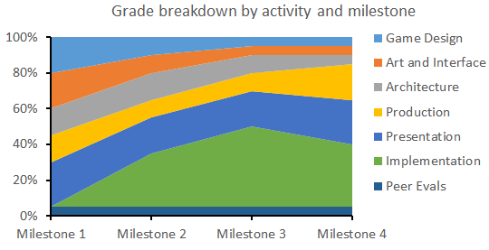
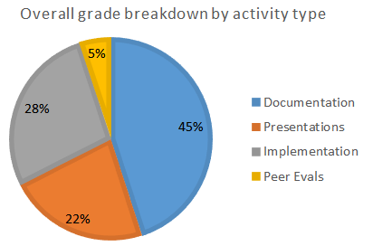

# IGME-106 Spring 2019 Team Project Guidelines
This document contains an overview of what you'll be doing with each milestone and links to the required documentation.

## Grading
Each milestone is equally weighted towards the 20% of your final grade. Within each milestone, the documentation, presentation, and implementation elements are weighted differently depending on the focus of that particular milestone:

| *Milestone* | *Due Date* | *Game Design* | *Art and Interface* | *Architecture* | *Production* | *Presentation* | *Implementation* | *Peer Evals* |
|-----------|----------|-------------|-------------------|--------------|------------|--------------|----------------|----------------|
| [Milestone 1](#milestone-1) | | 20% | 20% | 15% | 15% | 25% | 0% | 5% |
| [Milestone 2](#milestone-2) | | 10% | 10% | 15% | 10% | 20% | 30% | 5% |
| [Milestone 3](#milestone-3) | | 5%  | 5%  | 10% | 10% | 20% | 45% | 5% |
| [Milestone 4](#milestone-4) | | 5%  | 5%  | 5%  | 20% | 25% | 35% | 5% |

Overall, this means that:
- Documentation (of all types, including peer evals which are graded individually) is worth 50% of your project grade
- Presentations are worth 23%
- Implementation (that matches your documentation) is worth 28%

Everything will be graded in terms of: 
- How much of the required content is present
- The quality of the content (i.e. good use of OO design and data structures in the architecture, an implementation that matches the architecture documentation, etc.)
- The quality of the deliverable itself (i.e. delivery for presentations, organization and clarity for documentation, coding standards, etc. for implementation)

Because grading these types of materials can be subjective, everything will be graded at one of 5 levels:

| *Rubric Level* | *Description* | *% of max possible points* |
|----------------|---------------------------------------------------|---------|
| *Exceptional* | Covers all of the required content in an organized and engaging manner. Only very minor issues. | 100% |
| *Competent* | Organized and engaging but missing some of the required content. *or* Covers all of the required content, but lacks organization or has noticeable quality issues.| 88% |
| *Acceptable* | Missing significant content *or* has significant issues with the quality of the content that is present. | 75% |
| *Developing Skills* | Missing significant content *and* has significant issues with the quality of the content that is present. | 50% |
| *Unacceptable* | Clearly inadequate or did not submit at all. | 0% |

*Templates for each type of documentation have been provided. You can change/reorganize as you see fit as long as the required content is included for each milestone.*

## In _Every_ Milestone

1. Make sure all previous completed documentation is still accurate
* [Game Design](doc/GameDesign.md)
* [Art and Interface](doc/Art.md)
* [Architecture](doc/Architecture.md)
* [Production](doc/Production.md)
* [Game Design](doc/GameDesign.md)
2. Keep the [Meeting Log](doc/mtgLog.md) log up to date to track when your team meets and the main topic(s) of discussion.
3. Make sure to also keep the weekly meeting time on the main [README](../README.md) up to date.
4. Update how tasks are being managed as needed in the main [doc/Production.md](doc/Production.md) document
5. Add a summary of the milestone's progress and lessons learned to [doc/milestones.md](doc/milestones.md) _(The more thought you put into this, the easier it will be to write the [postmortem](doc/postmortem.md) at the end of the project.)_
6. Make a final release tag (vN.0) and document what it contains in [src/Release Notes.md](src/Release Notes.md)

## Milestone 1
*Creating a plan*
_You main goal for milestone 1 is establishing your game concept, game play, and a prioritized feature list. Once you have this, you'll make initial art/UI mockups and start your technical design (state machines, classes, etc.). During milestone 1, you'll also establish how your team will keep itself organized and manage tasks._

### [Game Design](doc/GameDesign.md)
Decide how the game should be designed. All games must be 2D, but the design is up to your group. You may want to look at the often unique designs of the games submitted to the Independent Game Festival. Some things to consider:
- What genre is the game? 
- Is it a knockoff game? 
- What are the objectives of the game? 
- How many players does the game allow? 
- Is it turn-based or real-time? 
- What is the look-and-feel of the game? 
- Will the game have multiple levels?
- What makes the game fun?

You should not simply implement an existing game (like Pac Man, Tetris or Chess).  If you want to use an existing game as inspiration, that is great, but make it your own.  Five points of this assignment will be dedicated to the creativity shown in game design.

*This document should be largely complete by the end of milestone 1. In subsequent milestones (especially #2), you may need to refine the concept and add details.*

### [Art and Interface](doc/Art.md)
Describe how your game looks and feels.  Does it have a visual style?  How will you gather art for the game?  How does the user interact with your game?  Describe both the interface and the control scheme(s).  What are the user interface requirements (health bars, ammo, units, etc.)?  

*Milestone 1 must include a UI prototype with a mockup of all menus, user interfaces and example game screens.*  While these will be a rough draft, it is expected that each group will spend time thinking about what the user really needs and how the game will look.  Having a solid plan makes implementing the game easier later. In subsequent milestones, you will refine the concept and add details (especially screenshots, etc.).

### [Architecture](doc/Architecture.md)
Decide on the program architecture of your game. Your game must be data driven and must read in content from one or more files. Some things to consider:
- What classes will you need in your game?
- How will your characters, enemies & NPCs be handled?
- Will there be some common base classes that are extended by different entities in your game?
- Will you need any abstract classes and/or interfaces?
- How will input be handled?

Your architecture must describe ALL of the classes and interactions that will occur during your game development.  Although game development is a largely iterative process, plan as much as possible in advance.  “We’ll figure it out later” won’t work here. Do recognize that certain architecture decisions may change throughout the development process, and that is completely acceptable (and often normal for game dev!)

Your game may not use third party software (physics systems, pre-built engines, etc.) unless given the ok by the professor. Previous experiences have shown that often when such software is used, a greater part of the quarter is spent learning how to use the software rather than learning about algorithms and data structures, which is what this course is about. 

*Milestone 1 must include:*
- A diagram of all the classes and interfaces that your project will implement, and display the relationships between those classes. 
- A state diagram of the primary game modes with at least a high level description of how you plan to implement this (i.e. which classes it impacts).

### [Production](doc/Production.md)
*By the end of milestone 1, you will document:*
- Scope
- Task management
- Task breakdowns
- Testing strategies

#### Scope
*Minumum Viable Product (MVP)*
What are the minimal specifications you need to have a working version of the game by the end of the semester?_

*Extra Features*
Which elements of the game fall under “if we have time”?_ How are you going to develop the game, test it, and integrate all group members’ code together? What deliverables will you have throughout the project?

#### Task Management
Having a game design and architecture plan so you know what you want to implement is crucial, but it won't be enough unless you also break it down into tasks that individuals can claim and work on. Tasks must also be prioritized based on your desired scope (i.e. MVP above) and dependencies between them.

How you manage tasks is up to you, but you are *required* to establish some form of task tracking and keep it up to date. GitLab has issue tracking built in with the option of displaying issues in distinct lists on a [board](https://docs.gitlab.com/ee/user/project/issue_board.html) (and assgning issues to specific developers). You can also do something similar using [Trello](https://trello.com/). The tool you use doesn't matter, but you should, at a minimum, be able to know, at any given time, which tasks are:
- _Waiting to be defined_: In other words, you know something needs ot be done for this, and you don't want to forget about it, but you haven't completed enough game design or figured out how to implement it yet.
- _Waiting to be done_: You know everything you need to know to start implementation on this (or writing/drawing if it's a documentation or art task), but no one is working on it yet.
- _In progress_: Tasks that someone is actively working on (these should also someone indicate *who* is working on it)
- _Done_: All set (documented, implemented, tested, etc.)

Whatever you decide to do, add instructions/links in your production document so that everyone can find your current task list._

#### Task Breakdowns
*Start this this during Milestone 1 and complete it in Milestone 2. Update it as needed throughout the semester.*
In order to divide work effectively, take some time to consider how you'll break down tasks into independent "chunks". Some potential categories of work include:
- _Character and Object Implementation:_ This person works on any core classes for characters, enemies and other game objects. It may be advantageous for some of these classes to be used by both the game and the external tool (such as a behavior or map editor). A variety of algorithms and data structures may be used such as character movement/physics and collision detection.
- _Tool Builder / Level or Map Editor:_ This person designs all map or level-related classes and may build the external tool. Since characters and items usually appear in a game map or level, the person carrying these responsibilities should work closely with the character and object implementation person to figure out the file format & saving/loading process for the game before either begins work.
- _Game View:_ This person is in charge of the basic drawing of the screens in the game, from the GUI to the game screens themselves. Note that if it is a graphics intensive game, a role like this may be better suited for two people. Animation loops can satisfy the algorithm requirement for this part of the assignment as well as the many routines that may be used for “camera” movement and item drawing. 
- _Gameplay:_ This person is generally in charge of implementing the logic behind the game, such as the differences between game states (world map and battle screens, for instance).  The gameplay role usually involves creating the finite state machine(s) that drive the game.

#### Testing
*Start this this during Milestone 1 and complete it in Milestone 2. Update it as needed throughout the semester.*

While you won't be making detailed test plans or doing any automated testing for this project, you should think about how you will test your game. Will you just play through it a lot? Are there specific scenarios you need to test? What questions will you ask of your play testers? Where/how will you track bugs that you find? (GitLab does have support for [issue tracking](https://docs.gitlab.com/ee/user/project/issues/). If you want help using this, ask your instructor.

### [Presentation](doc/Presentations.md)
Here is where you will present your group to the class.  Your group is your game studio, and your presentation is like a game pitch.  It tells the audience what you’re building, why you’re making it and how you plan on accomplishing what you’ve decided to create.

Each section of the presentation will be a summary of your documentation.  However, *don’t just copy and paste your write-up into a PowerPoint slide*; summarize the major points and explain them to the class.

Your presentation should contain each of the following four sections, with about 1 – 3 slides per topic depending on detail and visuals:
- *Design*: Talk about the design of your game: What type of game is it?  Does it draw upon other similar games?  What makes it unique, special, exciting, fun? Why are you excited to create it?
- *Architecture*: What will you need to do to make the game?  What are the general classes that will be required?  You must show a basic diagram of the classes and their relationships. Be sure to include this in your write-ups, too.  
- *Art and Interface*: What will the visual (art) style of the game be? What will we see on the screen?  What types of menus will we encounter?  What will the overall flow of your game be?  Show some of the interface mock-ups you’ve done and explain the choices you’ve made.
- *Production*: What is your game’s timeline?  Which pieces of the game are necessary vs. “if we have time”? What is your weekly meeting time?  How have they been going?  Have you been using any external tools (Google Docs, Google Calendar, Trello, etc.) to keep track of tasks and timelines?  

### [Implementation](src/ReleaseNotes.md)
No implementation is required for milestone 1. That said, I strongly suggest that your at least create the base MonoGame project, add it to version control, and make sure everyone can build/run it.

## Milestone 2
*Starting the technology*
Your main goal for milestone 2 is getting a “bare bones” version of your game up and running.  This means the game should start up and there is some core functionality present, such as character movement, game states, a menu system, etc.  It is a good idea to have code stubs for most components, in addition to working implementations of core functionality.

Since the games are required to be data-driven, your team must develop one external tool that helps to get data into a useable format for your game.  These tools should allow the team to quickly and easily alter some core data that the game uses.  This data will be stored in an external file, and read in when the game starts. The tool does not have to be 100% complete for this milestone, but it should be functional.

### [Architecture](doc/Architecture.md)
*External Tool:* Design and initial implementation required in milestone 2. Completed in milestone 3.
Since the games are required to be data-driven, your team must develop one external tool that helps to get data into a useable format for your game.  These tools should allow the team to quickly and easily alter some core data that the game uses.  This data will be stored in an external file, and read in when the game starts.

The tool that you use must make sense for your game.  A game with platforms might want to create a level editor, while a game with waves of enemies might want a tool to assist with the types and numbers of enemies in each wave.  Tools that allow you to quickly tweak default game settings (such as player speed, starting health) or handle AI movement could be good choices, too.

It is common to use something other than MonoGame to create these external tools.  Windows Forms is a popular choice because of the available UI components (buttons, sliders, text boxes, etc.)  The exact type of tool you create is up to you.

*Milestone 2 must include:*
- Updates to your diagrams, etc. as you refine your design and implementation plans.
- The technical design and initial implementation for an  external tool to support your game development.

### [Presentation](doc/Presentations.md)
Your group will present your progress up to this point.  

Using a shorter PowerPoint presentation than your first one, discuss anything that has changed since your initial plan: any changes to architecture, design, interfaces, or your timelines. 

Discuss where your group feels they are in the development timeline, and what they expect to have done for the next milestone.  

Lastly, demonstrate your game.  

### [Implementation](src/ReleaseNotes.md)
*By the end of milestone 2 you should have:*
- A skeleton for all major states, classes and behavior in your game
- Implementation of the basic controls to drive the game
- The skeleton of your exeternal tool with core functionality complete (i.e. basic file IO works even if not all information is complete and it isn't fully integrated into your game)

## Milestone 3
*It's almost a game, kind of, soft of...*
_You should have a basic working game for this milestone. You have four main goals for this part of your assignment:_
- _Finalize basic game algorithms_
- _Implement all game states_
- _Finish the external tool_
- _Continue implementing gameplay logic and algorithms_

### [Presentation](doc/Presentations.md)
Similar to the last milestone, your group will present your progress up to this point.  

Using a shorter PowerPoint presentation than your first or second ones, briefly mention everything that has been implemented in your game thus far. 

Next, discuss what you must implement for the last (and final!) milestone. 

Additionally, discuss your stretch goals and which ones you may have time to implement.  

Lastly, demonstrate your game.  

### [Implementation](src/ReleaseNotes.md)
*By the end of milestone 3:*
- _Your basic game algorithms (such as collision detection & response, animations, etc.) should be finalized for this milestone._  This means they should work the way you want, so you can move on to other areas of your game for the last milestone.  If you’re stuck or having problems, you can always stop by office hours or ask one of the gaming tutors for help.
- _All “minimally required” states of your game should be reachable._  They don’t have to all work perfectly or look pretty, but they should all be implemented at this stage.  This includes: menus, pause screens, level selection, battle modes, etc.  If you have some extra states that are on your “if we have time” list, they don’t need to be implemented yet.
- _The external tool should be finished so that it can be used for the last milestone._  It should read & write files as necessary to create maps, settings, etc. for your game.  
- _Other areas of the game should be progressing as well._  After this milestone you only have a few weeks until the game is due.  Follow your group’s timeline and make adjustments where necessary.

You may also find it useful to implement some of the new data structures and algorithms we have talked about this quarter: trees, hash tables, graphs, etc.  While not required, you may find that they can simplify some areas of your code or allow you to implement new features.

## Milestone 4
*Hey, look what we did!*
_Your assignment is to finish your game for this milestone.  If you have extra time, feel free to polish the game, add extra levels or implement any of your “extra” features. In addition to wrapping up the project and making sure all documentation is accurate, you'll work as a team to complete a [project post-mortem](postmortem.md)._

### [Production](doc/Production.md)
*At the end of milestone 4, you will also write a detailed project [postmortem](doc/postmortem.md).*
A postmortem is basically an analysis of a recently completed event.  

In the world of games, developers often do postmortems after completing a game.  The major sections of a game development postmortem are:
- What went right?
- What went wrong?
- What did you learn from this process?
- What will you do differently next time? 

Make sure to consider each question from the perspective of the game itself (concept, art, etc.), architecture, implementation, project management, team organization, etc.

To get a feel for postmortems, check out some of the [game postmortems from Gamasutra](http://www.gamasutra.com/features/postmortem/).

Choose two (or more) of the nearly 200 postmortems and read them fully.  Many games are represented; some date back as far as 1997.    

### [Presentation](doc/Presentations.md)
Create one (or more) slides for each of the following topics:
- What went right?
- What went wrong?
- What will you do differently in the future based on what you learned from this project?

Each member should have something to say for at least one of those questions.  

Lastly, demonstrate your game.  

### [Implementation](src/ReleaseNotes.md)
*By the end of milestone 4 you should have a polished game that includes all of your MVP (minimum viable product) features.* Be sure to document any known issues!
