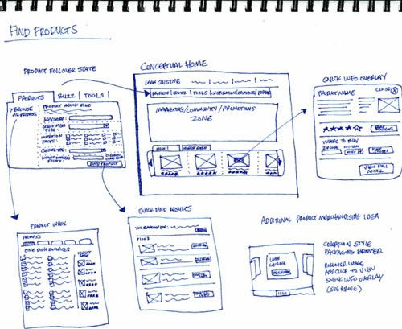

# IGME-106 Spring 2019 
# Team **YOUR_TEAM_NAME**

_This README contains basic information about the project and its artifacts. If kept up to date, it will act as a primary dashboard for the project._

## Team

- MEMBER1
- MEMBER2
- MEMBER3
- MEMBER4
- MEMBER5

## Goals
The primary goals of this project are the following:
1. Practice with the development of a larger project over the course of a semester
2. To gain experience working as a part of a small team
3. To implement a variety of game-related algorithms 
4. To implement data structures for a game 
5. To have fun making a game

## Mission Statement
_Replace this with the overall objectives that your team has agreed upon._
_What is the goal of the project (from a learning and product perspective)? Who is your target audience? How will you define success?_

## Communications

### Discord
_Add info about how to join/use your team's Discord channel. What is it?_

### Meeting Times
_Set at least 1 out-of-class meeting time and note times when the entire group is usually free for additional meetings as needed._

## Repository Overview
_As the project progresses, add notes here about how the repository is organized, how branches are being used, etc._

**Instructions about the required documentation/activities for each milestone can be found in [instructions/](instructions/Milestone Instructions.md).**

| File/Directory | Contents |
| -------------- | ----------- |
| [doc/mtgLog.md](doc/mtgLog.md) | A log of team meetings and general progress.  _Update this with each team meeting._|
| README.md | This document. A general project overview and artifact guide. _Update this as needed with extra references, etc._|
| [doc/milestones.md](doc/milestones.md) | Milestone overviews and lessons learned. _Update this with each milestone._ |
| [doc/GameDesign.md](doc/GameDesign.md) | Game concept and game play design. _Write this in milestone 1, but keep it up to date throughout the project._ | 
| [doc/Art.md](doc/Art.md) | How the game will look and feel. Includes verbal descriptions, stories, mock-ups and concept art. _Write this in milestone 1, but keep it up to date throughout the project._| 
| [doc/Architecture.md](doc/Architecture.md) | Technical documentation describing the classes required to implement the game (and how these classes will interact) _Write this in milestones 1&2, but keep it up to date throughout the project._ | 
| [doc/Production.md](doc/Production.md) | Project scope, planning, and task management information. _Write this in milestone 1, but keep it up to date throughout the project._ |
| [doc/Presentations.md](doc/Presentations.md) | Presentation instructions and materials for each milestone _Update this with each milestone._| 
| src/ | Implementation artifacts.|
| [src/ReleaseNotes.md](src/ReleaseNotes.md) | Summary of the implementation progress made during each milestone. _Update this with each milestone._| 

## Other Resources
- [MonoGame Documentation](http://www.monogame.net/documentation/?page=main)
- [Course schedule](https://people.rit.edu/~esmvcs/files/2185/IGME106_Course_Schedule_2185.htm)
- This [UML class diagram reference](https://www.uml-diagrams.org/class-reference.html) probably has more than you'll need, but it's a good starting point.
- [Markdown](https://docs.gitlab.com/ee/user/markdown.html) is a convenient method of documentation because it can have nice formatting while still being a plain text file (which allows multiple team members to edit sections and view/merge differences). _(I'm requiring it for this project because it also allows me to easily see changes over time and who worked on different sections of a document.)_

_You can incorporate images into this document by adding them to the folder and then linking them using the markdown syntax ``._ 

_For example `` results in:_

