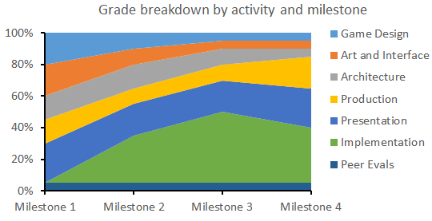
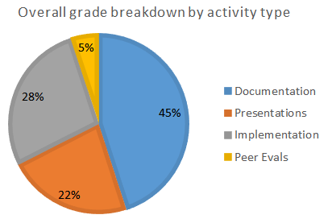

# IGME-106 Spring 2019 Team Project Guidelines
This document contains an overview of what you'll be doing with each milestone and links to the required documentation.

## Grading
Each milestone is equally weighted towards the 20% of your final grade. Within each milestone, the documentation, presentation, and implementation elements are weighted differently depending on the focus of that particular milestone:

| **Milestone** | **Due Date** | **Game Design** | **Art and Interface** | **Architecture** | **Production** | **Presentation** | **Implementation** | **Peer Evals** |
|-----------|-------|-------------|-------------------|--------------|------------|--------------|----------------|----------------|
| [Milestone 1](Milestone1.md) |F2/22/2019| 20% | 20% | 15% | 15% | 25% | 0% | 5% |
| [Milestone 2](Milestone2.md) |M3/18/2019| 10% | 10% | 15% | 10% | 20% | 30% | 5% |
| [Milestone 3](Milestone3.md) |F4/12/2019| 5%  | 5%  | 10% | 10% | 20% | 45% | 5% |
| [Milestone 4](Milestone4.md) |M4/29/2019| 5%  | 5%  | 5%  | 20% | 25% | 35% | 5% |

Overall, this means that:
- Documentation (of all types, including peer evals which are graded individually) is worth 50% of your project grade
- Presentations are worth 23%
- Implementation (that matches your documentation) is worth 28%

Everything will be graded in terms of: 
- How much of the required content is present
- The quality of the content (i.e. good use of OO design and data structures in the architecture, an implementation that matches the architecture documentation, etc.)
- The quality of the deliverable itself (i.e. delivery for presentations, organization and clarity for documentation, coding standards, etc. for implementation)

Because grading these types of materials can be subjective, everything will be graded at one of 5 levels:

| **Rubric Level** | **Description** | **% of max possible points** |
|----------------|---------------------------------------------------|---------|
| **Exceptional** | Covers all of the required content in an organized and engaging manner. Only very minor issues. | 100% |
| **Competent** | Organized and engaging but missing some of the required content. **or** Covers all of the required content, but lacks organization or has noticeable quality issues.| 88% |
| **Acceptable** | Missing significant content **or** has significant issues with the quality of the content that is present. | 75% |
| **Developing Skills** | Missing significant content **and** has significant issues with the quality of the content that is present. | 50% |
| **Unacceptable** | Clearly inadequate or did not submit at all. | 0% |

**Templates for each type of documentation have been provided. You can change/reorganize as you see fit as long as the required content is included for each milestone.**

## In _Every_ Milestone

1. Make sure all previous completed documentation is still accurate
- [Game Design](doc/GameDesign.md)
- [Art and Interface](doc/Art.md)
- [Architecture](doc/Architecture.md)
- [Production](doc/Production.md)
2. Keep the [Meeting Log](doc/mtgLog.md) up to date to track when your team meets and the main topic(s) of discussion.
3. Make sure to also keep the weekly meeting time on the main [README](../README.md) up to date.
4. Update how tasks are being managed as needed in the main [Production](doc/Production.md) document
5. Add a summary of the milestone's progress and lessons learned to [doc/milestones.md](doc/milestones.md) _(The more thought you put into this, the easier it will be to write the [postmortem](doc/postmortem.md) at the end of the project.)_
6. Make a final release tag (vN.0) and document what it contains in [src/Release Notes.md](src/Release Notes.md)
